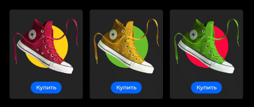

Вам прислали вёрстку карточек товара магазина обуви. Нужно добавить анимацию при наведении, в которой фоновый цвет карточки будет меняться на цвет круга внутри неё. Добавить наведение на кнопку. Анимации должны быть плавными.

Возможный итоговый вариант:
