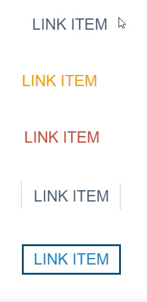

В этом задании вам предстоит добавить анимации при наведении и фокусе для нескольких ссылок. Исходное состояние ссылок уже готово, его менять не нужно. А вот состояния наведения и фокуса вам нужно продумать самостоятельно. А также добавить плавность для анимаций.

Вот несколько подсказок, которые помогут вам в работе с элементами:

У первой ссылки при наведении и фокусе появляются два псевдоэлемента с символами «[» и «]». Используйте прозрачность и transform: translateX().

У второй ссылки при наведении и фокусе снизу появляется псевдоэлемент с фоновым цветом #d88f0d. Используйте прозрачность и transform: translateY().

У третьей ссылки используйте data-атрибут и псевдоэлемент, чтобы показать скрытый текст при наведении. Для смещения элементов используйте clip-path или transform: translateY().

У четвёртой ссылки меняйте положение и прозрачность двух псевдоэлементов.

У пятой ссылки для создания обеих рамок используйте псевдоэлементы. Для анимации используйте прозрачность, transform: translateY() и transform: translateX().

Возможный итоговый вариант:
